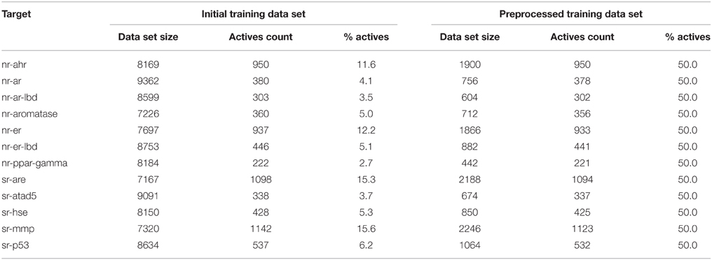
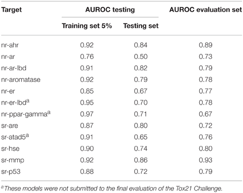
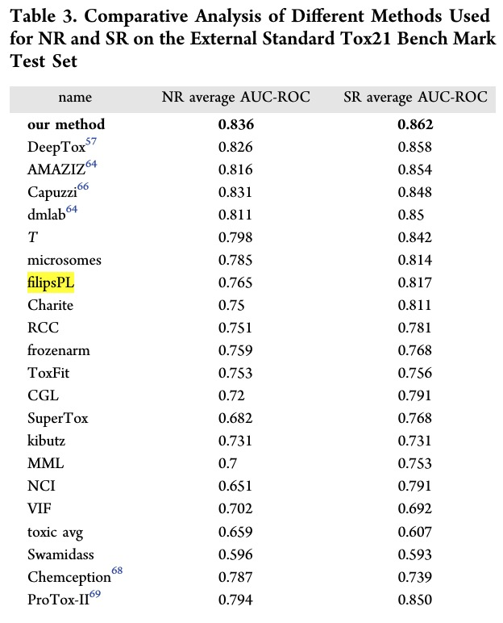
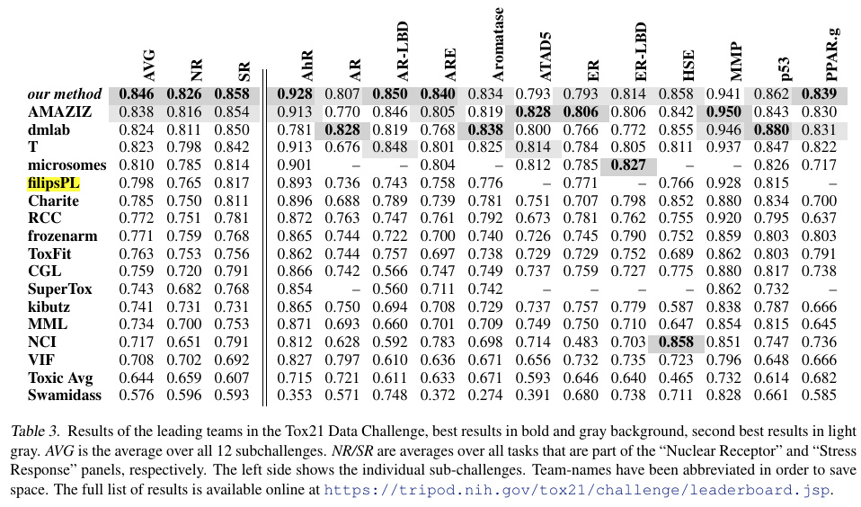

# Tox21 Data Challenge 2014 Datasets

## Introduction

> Toxicity evaluation of newly synthesized or used compounds is one of the main challenges during product development in many areas of industry. For example, toxicity is the second reason—after lack of efficacy—for failure in preclinical and clinical studies of drug candidates. To avoid attrition at the late stage of the drug development process, the toxicity analyses are employed at the early stages of a discovery pipeline, along with activity and selectivity enhancing. Although many assays for screening in vitro toxicity are available, their massive application is not always time and cost effective. Thus, the need for fast and reliable in silico tools, which can be used not only for toxicity prediction of existing compounds, but also for prioritization of compounds planned for synthesis or acquisition. Here I present the benchmark results of the combination of various attribute selection methods and machine learning algorithms and their application to the data sets of the Tox21 Data Challenge. The best performing method: Best First for attribute selection with the Rotation Forest/ADTree classifier offers good accuracy for most tested cases. For 11 out of 12 targets, the AUROC value for the final evaluation set was = 0.72, while for three targets the AUROC value was = 0.80, with the average AUROC being 0.784 ± 0.069. The use of two-dimensional descriptors sets enables fast screening and compound prioritization even for a very large database. Open source tools used in this project make the presented approach widely available and encourage the community to further improve the presented scheme. [F. Stefaniak, Front. Environ. Sci., 01 December 2015](https://doi.org/10.3389/fenvs.2015.00077)

## Datasets

Dataset used for modeling in the [Tox21 Data Challenge 2014](https://tripod.nih.gov/tox21/challenge/). Preprocessing steps, descriptors and modeling approach is decribed in [F. Stefaniak, Front. Environ. Sci., 01 December 2015](https://doi.org/10.3389/fenvs.2015.00077).

- `compounds` - list of compounds' names, activity and SMILES codes for compounds used in the training dataset
- `datasets` - tables with descriptors and activity values (column: `Activity`) in `csv` and `arff`/`weka` formats.

## Results

Global comparison:

Source: Efficient toxicity prediction via simple features using shallow neural networks and decision trees, A Karim, A Mishra, MAH Newton, A Sattar - ACS Omega, 2019 - ACS Publications.

Source: Toxicity prediction using deep learning, T Unterthiner, A Mayr, G Klambauer… - arXiv preprint arXiv …, 2015 - arxiv.org
